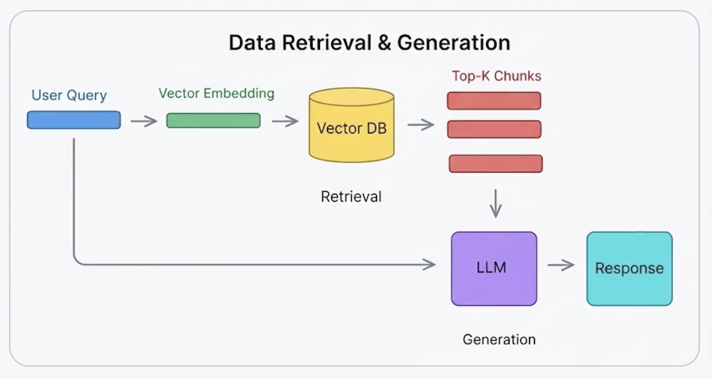
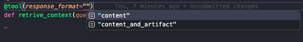

## 10. Document Assistant

- This will be a E2E complete project, considering:
  - Ingesting Documentation
  - RAG
  - LLM Memory
  - Streamlit FE

## Ingestion Pipeline

Source (LangChain Docs) > Load (get content) > Transform (split and create Docs) > Embed > Store

### Setup

- Pinecone:
  - OpenAI text embeddings 3 small - 1536 dimensions

- LangSmith

#### Dependencies

- **LLM / LangChain core**
  - `langchain` - core framework (chains, prompts, LCEL)
  - `langchain-openai` - OpenAI-specific integrations (chat models, embeddings)
  - `openai` - official OpenAI SDK, used under the hood by `langchain-openai`
  - `tiktoken` - OpenAI's tokenizer, used to count/estimate tokens (chunking, cost)

- **Vector store (Pinecone)**
  - `pinecone-client` - official Pinecone SDK (create/manage the index, upsert/query vectors)
  - `langchain-pinecone` - LangChain's `VectorStore` wrapper around Pinecone

- **Document ingestion / parsing**
  - `beautifulsoup4` - HTML parsing (used when scraping/cleaning the crawled LangChain docs pages)
  - `unstructured` - document loader/parser for many file types (html, pdf, etc.), used by LangChain's loaders
  - `nltk` - NLP toolkit; `unstructured` depends on it for text preprocessing (tokenizing sentences, etc.)

- **Backend / API**
  - `fastapi` - web framework to expose the assistant as an API
  - `uvicorn` - ASGI server to run the FastAPI app
  - `jinja2` - HTML templating engine (used by FastAPI for server-rendered pages, if any)

- **Frontend**
  - `streamlit` - builds the chat UI quickly, no separate frontend framework needed
  - `streamlit-chat` - chat-style message components on top of Streamlit

- **Utils / tooling**
  - `tqdm` - progress bars (useful during ingestion of many docs/chunks)
  - `python-dotenv` - loads env vars (`.env`) like API keys into the process
  - `black` - code formatter (dev tool, not runtime)

- We are going to work with `tavily-crawl`
- Its going to scrape LangChain Docs, so we can ingest it

### Imports

```python
import os
import ssl
import asyncio
import certifi
from dotenv import load_dotenv
from typing import Any, Dict, List

from langchain_chroma import Chroma
from langchain_openai import OpenAIEmbeddings
from langchain_core.documents import Document
from langchain_pinecone import PineconeVectorStore
from langchain_tavily import TavilyCrawl, TavilyExtract, TavilyMap
from langchain_text_splitters import RecursiveCharacterTextSplitter
```

- `os` - env vars
- `ssl` + `certifi` - fix HTTPS cert verification for the crawl requests
- `asyncio` - run ingestion async (crawl many pages concurrently)
- `load_dotenv` - load `.env`
- `typing` - type hints
- `Chroma` - local/alt vector store (for quick tests vs Pinecone)
- `OpenAIEmbeddings` - embed text into vectors
- `Document` - LangChain's core text + metadata object
- `PineconeVectorStore` - store/query embeddings in Pinecone
- `TavilyCrawl` / `TavilyExtract` / `TavilyMap` - scrape LangChain docs (crawl site, map URLs, extract content)
- `RecursiveCharacterTextSplitter` - split docs into chunks before embedding

### Tavily Crawling

- Check Docs - Theres a page on Tavily Crawl best practices
- **Obs.:** This is simpler, and attends most cases probably

```python
    res = tavily_crawl.invoke(
        {
            "url": "https://python.langchain.com",
            "max_depth": 5,  # Usually start with 1 - 2 and test (check docs)
            "extract_depth": "advanced",  # Extracts more data
            # "instructions": "content on ai agents",  # Natural language to instruct the crawler
        }
    )
    # For each result we want to create a LangChain Document
    all_docs = [
        (
            Document(
                page_content=result["raw_content"], metadata={"source": result["url"]}
            )
        )
        for result in res["results"]
    ]
```

#### Tavily Map and Extract: Splitting in Batches (more control and performance)

- We called `Step 1B` on the ingestion code
  - Splitting into Map and Extract we have more control on the process
  - Also, we are able to split into batches and use async methods, **which makes the solution more scalable**

## Retrieval



- For the retrieval we are going to create an agent with a retrieval tool
  - Tool Response format:
    
    - Content (default) - only content
    - Content and artifact : returns 2 values
      - The artifact is not being sent to LLM, but it might be useful for us, so we handle the retrieved docs ids

  - **About the artifacts**:
    - The artifact is any structured Python object that the tool wants to return to the application, but not send to the LLM.
    - We can see that the `ToolMessage`s contain artifact (which is structured data regarding the retrieved document - not to be used in the llm, but in our code)
      - Without artifacts, the agent would return only one thing (the regular answer)
      - With the artifact (again, set up in the tools decorator) we see meta data, doc id, etc
    - In the code we loop all messages, look for the artifacts

## Frontend

- We are going to create a basic UI with streamlit (not recommended for prod)
  - Actually it seems pretty fast for MVPs
  - We can understand the idea checking the code, while the state is being handled in `session_state`
