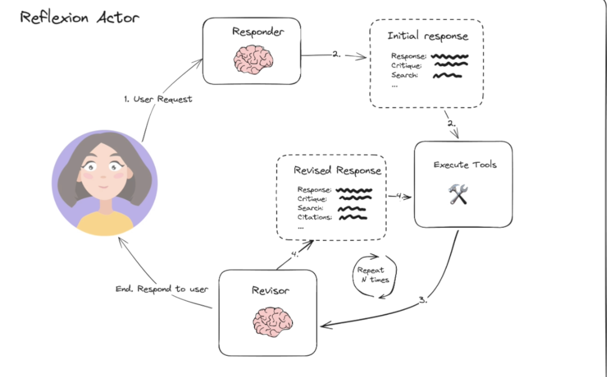

# LangGraph — Reflection Agent

## What are we building

- It is going to extend the concept of reflection agent, and incorporate tools like Tavily to extract real time data and really critique and implement the critiques

## Architecture

## Core idea

        BASE REFLECTION PROMPT:
        Review the tweet and determine why it succeeded or failed.

        ATTEMPT #1:
        "BJJ is cool."

        EVALUATION:
        FAILED

        REFLECTION / MEMORY:
        "The tweet lacks enthusiasm, a strong hook,
        and relevant hashtags."

                ↓

        ATTEMPT #2 receives:

        Original task

        - Previous attempt
        - Memory:
        "The previous attempt failed because it lacked
        enthusiasm, a hook and hashtags."

                ↓

        NEW ATTEMPT:
        "Do you know what's called human chess?
        BJJ challenges your body and mind like few
        other sports! #BJJ #MartialArts"

                ↓

        EVALUATE AGAIN

## What we will use

- GPT 4 Turbo (good critique and reflection)
- Function Calling
- Tavily Search Engine
- LangSmith
