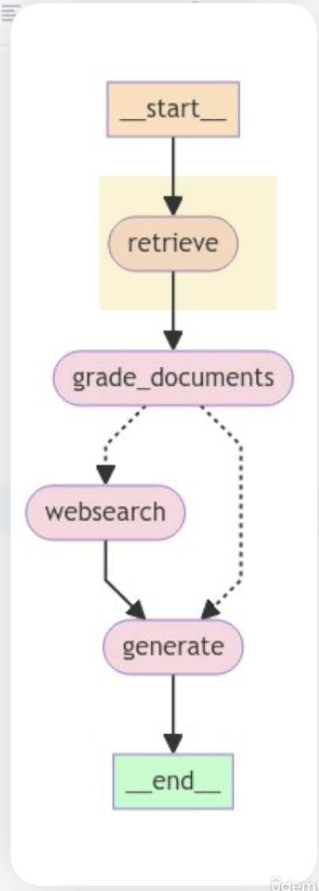

# LangGraph — Agentic RAG

[**Course Repo**](https://github.com/emarco177/langgraph-course/commits/project/agentic-rag/)

## What are we building - C-RAG (Corrective RAG)

- Basically its A RAG architecture with a corrective/self-evaluation layer over retrieval
  - We get the context using RAG to retrieve Docs
  - We add a reflection layer to analyze if the retrieved docs are really relevant for the original query
    - If it is, all good
    - If it is not, filter them out, and look for more context

  - 

### Ingestion

- We are going to use ChromaDB as vector store
  - So it stores locally

- **Obs.:** The ingestion part can be improved / made more complex, but for this project we are sticking to the basics, while focusing on more complex retrieval

- **Gotcha:** `Chroma.from_documents(...)` (the write step) is commented out by default — `retriever` only opens the collection, doesn't seed it.

### State

- Simply defining the Schema

- Only `question` is required in `GraphState`; `generation`/`web_search`/`documents` are `NotRequired`, filled in as the graph runs.

### Grade Documents

- We want to iterate over the documents and score if they are relevant or not

- Grading is a separate structured-output chain (`GradeDocuments.binary_score`); any `"no"` sets `web_search = True` to trigger the fallback.

### Web Search Node

- Corrective fallback via `TavilySearch` — joins results into one `Document`, appends to existing `documents`.

### Generation Node

- Plain `prompt | llm | StrOutputParser()` chain.
- **Bug to fix:** `documents` passed unformatted into `{context}` — `str(Document)` includes bulky metadata, risks blowing the context window.

### Graph

- `StateGraph(GraphState)`, entry point `RETRIEVE` → `GRADE_DOCUMENTS` → conditional edge (`decide_to_generate`, reads `web_search` flag) → `WEBSEARCH` or `GENERATE` → `GENERATE` → `END`.
- `main.py` invokes it: `app.invoke({"question": ...})`.

## Self Rag

- It basically reflects on the answer generated, to confirm its a good enough answer (and related to the documents)
  - We added the `answer_grader` and `hallucination_grader` to the logic

## Adaptive RAG

- Adding a question router to route our question to different RAG flows
  - We added the `router` to determine if we are going to make a websearch OR retrieve documents
