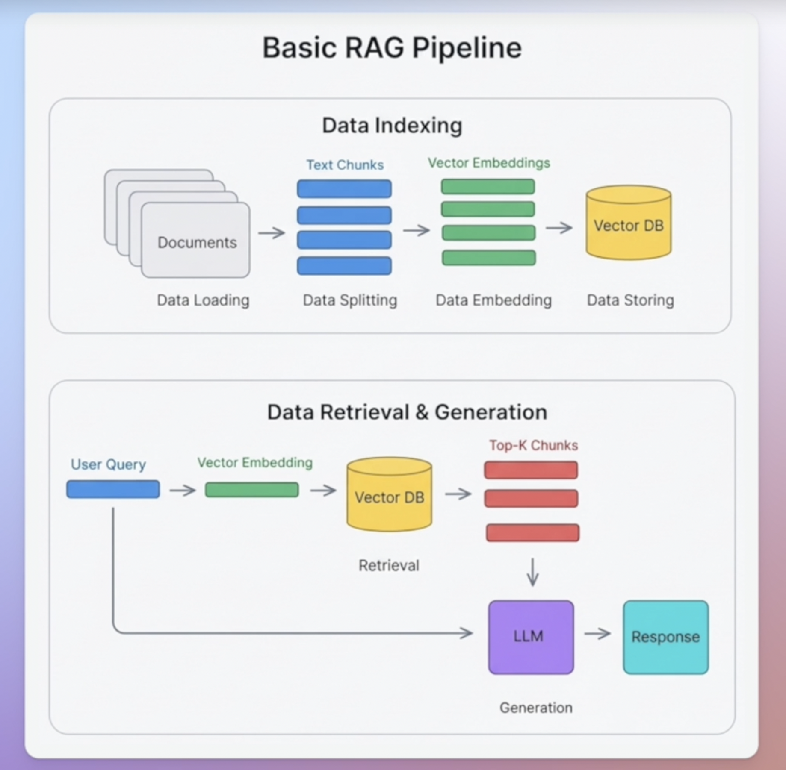

## RAG (Retrieval Augmentation Generation) - Embeddings, Vector Databases and & Retrieval



### Concept

- Imagine we have a large document with specific info, we want the LLM use as a base
  - A very naive approach would be to give all the document context on every prompt
    - Bad, limits, tokens, latency etc
  - The other solution would be RAGs:
    - split it in chunks
    - Find the correct chunk
    - Add only the needed chunk as context in the LLM prompt

- There are some challenges on this:
  - Correct preprocessing step for generating the chunks
  - Precise search mechanism to find the relevant chunks

### Intro to Implementation

### Vector Databases

- Embeddings, Vector Stores (Pinecone), RetrievalQA Chain, LangChain Document Loaders, Document Splitters
  - Document / Document Loaders > What will contain the text (pdf, notion file etc)
  - Text Splitters > Split our text in smaller chunks, and there are different strategies for this

- We cant simply send chunks as prompt, since the more knowledge, the more expensive and redundant each api call would be
  - So we need to find out a way of sharing only the relevant chunks for a specific answer

- **Embeddings:**
  - Its a technique of creating a vector space from the text, such that the distance of the vectors in the space have a meaning
    - We can simply consider it a black box, but in theory, the vectors (and the space "position") are defined by the meaning of each snippet (word or sentence) - the closer meaning, the closer vector value

- So basically if we have a book:
  - Split it into thousands or even millions of chunks > embed them using an embedding model (turning them into a vector) > save into vector database
  - When there is a query: We embed it, and then we calculate the closest vectors > closest chunks are sent in the context > LLM answer it

### Boiler Plate Setup

- Install dependencies:
  - `uv add langchain langchain_openai langchain-pinecone langchain-text-splitters langchain-unstructured python-dotenv langchainhub unstructured black isort`

- Pinecone:
  - Database > Create index > Text Embedding 3 Small (Open AI) > Dimension: 1536 (longer = more information)
  - Add to the env the API KEY (name it `PINECONE_API_KEY`) and also the `INDEX_NAME`

### Ingestion

Ingest the text data in the vector store

- Loading the blog text (text loader)
- Splitting the text into chunks (TextSplitter)
- Embed the chunks and get vector (OpenAIEmbeddings)
- Store the embeddings in Pinecone vector store (PineconeVectorStore)

```python
from langchain_openai import OpenAIEmbeddings
from langchain_pinecone import PineconeVectorStore
from langchain_text_splitters import CharacterTextSplitter
from langchain_community.document_loaders import TextLoader
```

- TextLoader
  - Basically classes implementations about how to process different text formats (from different files)
  - We can see in Langchain the original files for the text loader for different texts (whatsapp, notion etc)
  - Sure LangChain have it already done, so we can parse and manipulate it easily and in the same way for different files
  - In LangChain docs we can see there are others, for example `langchain_docling` for getting text from web

- TextSplitter
  - Split it into chunks (again, many strategies possible)
    - These param are the basics rule of thumb (chunk size and chunk overlap)
      - Remember the more context in a prompt, the less precise it tends to be

  ```python
    text_splitter = CharacterTextSplitter(chunk_size=1000, chunk_overlap=0)
    texts = text_splitter.split_documents(document)
  ```

- OpenAIEmbeddings
  - Embed the chunks into vectors
  - It estimates a rate of 3000 pages per dollar
  - **Important:** Ensure the model used contains the same dimensions as the index (or customize dimensions)
    - `embeddings = OpenAIEmbeddings(model="text-embedding-3-small")`
    - `embeddings = OpenAIEmbeddings(model="text-embedding-3-large", dimensions=1536)`

### Retrieval

- Take user Query > Embed into a vector > Get the Top-K chunks > Feed the LLM with Query + Closest chunks

- We are going to compare the retrieval without and with LCEL

- Without LCEL > More verbose, error-prone, harder to maintain, etc
