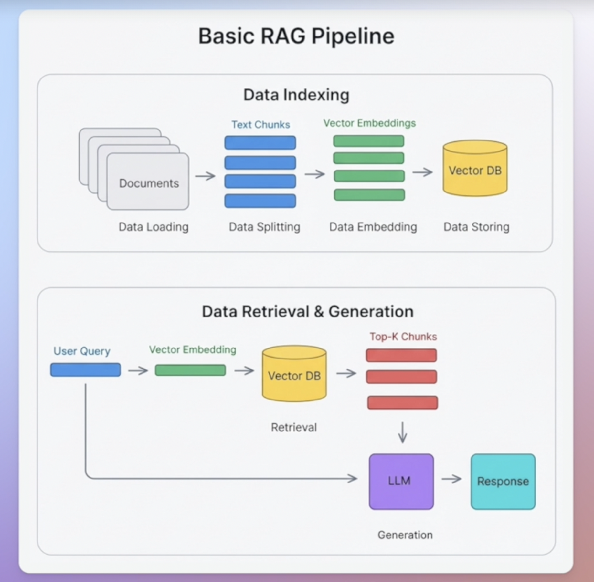

## RAG (Retrieval Augmentation Generation) - Embeddings, Vector Databases and & Retrieval



### Concept

- Imagine we have a large document with specific info, we want the LLM use as a base
  - A very naive approach would be to give all the document context on every prompt
    - Bad, limits, tokens, latency etc
  - The other solution would be RAGs:
    - split it in chunks
    - Find the correct chunk
    - Add only the needed chunk as context in the LLM prompt

- There are some challenges on this:
  - Correct preprocessing step for generating the chunks
  - Precise search mechanism to find the relevant chunks

### Intro to Implementation

### Vector Databases

- Embeddings, Vector Stores (Pinecone), RetrievalQA Chain, LangChain Document Loaders, Document Splitters
  - Document / Document Loaders > What will contain the text (pdf, notion file etc)
  - Text Splitters > Split our text in smaller chunks, and there are different strategies for this

- We cant simply send chunks as prompt, since the more knowledge, the more expensive and redundant each api call would be
  - So we need to find out a way of sharing only the relevant chunks for a specific answer

- **Embeddings:**
  - Its a technique of creating a vector space from the text, such that the distance of the vectors in the space have a meaning
    - We can simply consider it a black box, but in theory, the vectors (and the space "position") are defined by the meaning of each snippet (word or sentence) - the closer meaning, the closer vector value

- So basically if we have a book:
  - Split it into thousands or even millions of chunks > embed them using an embedding model (turning them into a vector) > save into vector database
  - When there is a query: We embed it, and then we calculate the closest vectors > closest chunks are sent in the context > LLM answer it

### Boiler Plate Setup

- Install dependencies:
  - `uv add langchain langchain_openai langchain-pinecone langchain-text-splitters langchain-unstructured python-dotenv langchainhub unstructured black isort`

- Pinecone:
  - Database > Create index > Text Embedding 3 Small (Open AI) > Dimension: 1536 (longer = more information)
  - Add to the env the API KEY (name it `PINECONE_API_KEY`) and also the `INDEX_NAME`

### Ingestion

Ingest the text data in the vector store

- Loading the blog text (text loader)
- Splitting the text into chunks (TextSplitter)
- Embed the chunks and get vector (OpenAIEmbeddings)
- Store the embeddings in Pinecone vector store (PineconeVectorStore)

```python
from langchain_openai import OpenAIEmbeddings
from langchain_pinecone import PineconeVectorStore
from langchain_text_splitters import CharacterTextSplitter
from langchain_community.document_loaders import TextLoader
```

- TextLoader
  - Basically classes implementations about how to process different text formats (from different files)
  - We can see in Langchain the original files for the text loader for different texts (whatsapp, notion etc)
  - Sure LangChain have it already done, so we can parse and manipulate it easily and in the same way for different files
  - In LangChain docs we can see there are others, for example `langchain_docling` for getting text from web

- TextSplitter
  - Split it into chunks (again, many strategies possible)
    - These param are the basics rule of thumb (chunk size and chunk overlap)
      - Remember the more context in a prompt, the less precise it tends to be

  ```python
    text_splitter = CharacterTextSplitter(chunk_size=1000, chunk_overlap=0)
    texts = text_splitter.split_documents(document)
  ```

- OpenAIEmbeddings
  - Embed the chunks into vectors
  - It estimates a rate of 3000 pages per dollar
  - **Important:** Ensure the model used contains the same dimensions as the index (or customize dimensions)
    - `embeddings = OpenAIEmbeddings(model="text-embedding-3-small")`
    - `embeddings = OpenAIEmbeddings(model="text-embedding-3-large", dimensions=1536)`

### Retrieval

- Take user Query > Embed into a vector > Get the Top-K chunks > Feed the LLM with Query + Closest chunks

- We are going to compare the retrieval without and with LCEL

- Without LCEL > More verbose, error-prone, harder to maintain, etc

- **prompt_template:** We just add the variables as if we were creating f strings
  ```python
  prompt_template = ChatPromptTemplate.from_template("""
    Use the following pieces of context to answer the question at the end.
    If you don't know the answer, just say that you don't know, don't try to make up an answer.
    {context}
    Question: {question}
    Provide a Detailed Answer:
    """)
  ```

```python
def retrieval_chain_without_lcel(query):
    """Retrieve documents and generate an answer without using LCEL"""

    # Step 1: Retrieve relevant documents based on the question
    docs = retriever.invoke(query)

    # Step 2: Format the retrieved documents
    context = format_docs(docs)

    # Step 3: Format the prompt with the context and question
    messages = prompt_template.format_messages(context=context, question=query)

    # Step 4: Generate the answer using the LLM
    response = llm.invoke(messages)

    # Step 5: return the generated answer
    print("Answer (without LCEL):", response.content)
    return response.content
```

- With LCEL:

  ```python
  from operator import itemgetter
  from langchain_core.runnables import RunnablePassthrough
  from langchain_core.output_parsers import StrOutputParser
  ```

  - Advantages:
    - Declarative and composable - Easy to chain operations with `|`
    - built-in streaming: `chain.stream()`
    - built-in async: `chain.ainvoke()` and `chain.astream()`
    - batching
    - Type safety
    - Less code and reusable

  ```python
    retrieval_chain = (
        RunnablePassthrough.assign(
            context=itemgetter("question")
            | retriever
            | format_docs  # LangChain converts into Runnable Lambdas
        )
        | prompt_template  # prompt template
        | llm  # invokes the LLM with the formatted prompt
        | StrOutputParser()  # extract the content from the LLM response
    )
  ```

  ### How it works:
  - Remember that LCEL uses the | operator to compose Runnables. The output of one Runnable becomes the input of the next Runnable.
    - Check without LCEL, we are "manually chaining"
    - But there was 1 exception:
      - For the `prompt_template` we needed to transform the original input from `{"question": "lorem ipsum"}` into `{"question": "lorem ipsum", "context": "lorem ipsum"}`
    - Thats why we needed the `RunnablePassthrough.assign`:
      - It receives another Runnable (a chain) responsible for computing the value of the new field.
        - **Obs.:**(LangChain transforms every function into a Runnable - thats why format_docs works)
      - The Runnable computes the value for context, and `RunnablePassthrough.assign()` adds that key-value pair to the original input dictionary.
      - Conceptually, `RunnablePassthrough.assign()` is equivalent to: `input["context"] = context_chain.invoke(input)` except that it returns a new dictionary instead of mutating the original one.

## About LangChain Docs

- Eden also discuss he doesn't really like the LangChain docs for RAGs, since they suggest to create a ReAct agent that decides to use a retrieval tool
  - It has their view about pros and cons of their approach - Eden reinforces this way displayed is the real one used in production
